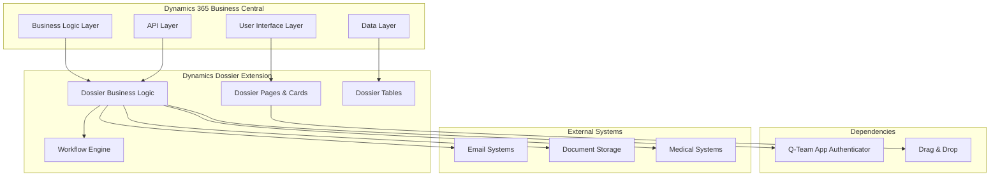
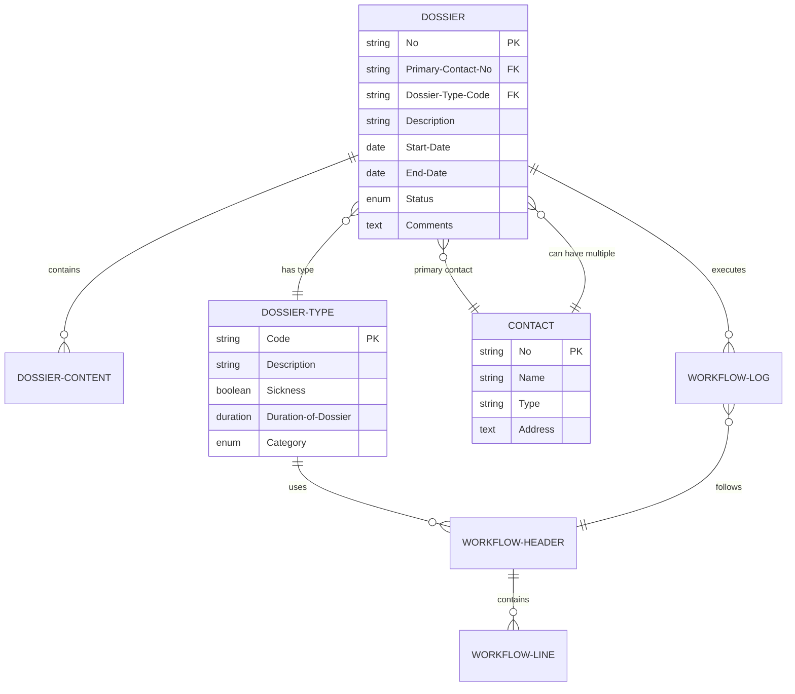
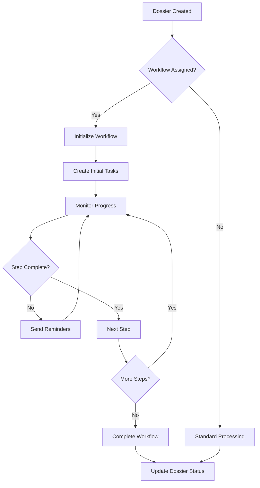

# Architecture Overview

## System Architecture

Dynamics Dossier follows a modern, extensible architecture built specifically for Microsoft Dynamics 365 Business Central. The system is designed with modularity, scalability, and maintainability in mind.

## High-Level Architecture



## Core Components

### 1. Data Layer

The data layer consists of several key tables that form the foundation of the dossier system:

#### Primary Tables
- **QTEAM Dossier** (11195787) - Main dossier records
- **QTEAM Dossier Type** (11195814) - Dossier categorization
- **QTEAM Dossier Setup** (11195789) - System configuration

#### Workflow Tables
- **QTEAM Work Flow Header** (11195837) - Workflow definitions
- **QTEAM Work Flow Line** (11195838) - Workflow step details
- **QTEAM Work Flow Log Entry** (11195873) - Workflow execution tracking

#### Supporting Tables
- **QTEAM Dossier Progress** - Progress tracking
- **QTEAM Dossier Content** - Document and content management
- **QTEAM Department** - Organizational structure

### 2. Business Logic Layer

The business logic is implemented through several codeunits:

#### Core Management
- **QTEAMDossierMgt** - Main dossier management logic
- **QTEAMDossierContentMgt** - Document and content handling
- **QTEAMDossierHistoryMgt** - History and audit trail management

#### Specialized Management
- **QTEAMDisabilityManagement** - Disability-related processes
- **MedicalConnectionMgt** - Medical system integrations
- **QTEAMConfidentialityMgt** - Privacy and confidentiality controls

#### System Services
- **QTEAMLicenseMgt** - License validation and compliance
- **QTEAMEMailQueueManagement** - Email integration
- **QTEAMPlannerManagement** - Appointment and task management

### 3. User Interface Layer

The UI layer provides intuitive interfaces for dossier management:

#### Main Interfaces
- **QTEAM Dossier Card** - Primary dossier interface
- **QTEAM Dossier List** - Dossier overview and selection
- **QTEAM Dossier Content** - Document and content management

#### Supporting Interfaces
- **QTEAM Dossier Setup** - System configuration
- **QTEAM Dossier Type Card** - Dossier type management
- **QTEAM Contact Card Extension** - Enhanced contact management

#### FactBoxes and Parts
- **QTEAM Dossier FactBox** - Quick dossier information
- **QTEAM Dossier Contact FactBox** - Contact-related information

## Data Model

### Core Entity Relationships



### Field-Level Architecture

#### Primary Key Strategy
- **Dossier Numbers**: Generated using Business Central Number Series
- **Sequential IDs**: Used for log entries and progress tracking
- **Code Fields**: Used for setup and configuration tables

#### Data Classification
All fields are properly classified according to Business Central data classification requirements:
- **CustomerContent**: Business data that can contain customer information
- **EndUserIdentifiableInformation**: Data that can identify end users
- **SystemMetadata**: System-generated administrative data

## Integration Architecture

### Authentication & Security
- Integrates with Business Central permission system
- Uses Q-Team App Authenticator for enhanced security
- Role-based access control for sensitive medical data
- Field-level security for confidential information

### External System Integration

#### Email Integration
- Queue-based email processing
- Template-based email generation
- Automatic notification system
- Error handling and retry mechanisms

#### Document Management
- Integration with SharePoint/OneDrive
- Local file system support
- Document versioning and history
- Drag & drop functionality via dedicated extension

#### Medical Systems
- Configurable medical system connections
- Data import/export capabilities
- Patient number matching
- Compliance with medical data standards

## Workflow Engine

### Workflow Architecture
The workflow system provides flexible, configurable process automation:

#### Components
1. **Workflow Headers** - Define workflow templates
2. **Workflow Lines** - Individual workflow steps
3. **Workflow Log Entries** - Track execution and progress

#### Workflow Types
- **Time-based**: Trigger after specified durations
- **Event-based**: Trigger on dossier state changes
- **Manual**: User-initiated workflow steps

### Process Flow



## Performance Considerations

### Optimization Strategies
- **Indexed Fields**: Strategic indexing on frequently queried fields
- **FlowFields**: Calculated fields for real-time data aggregation
- **Filtered Views**: Reduce data load through smart filtering
- **Caching**: Temporary storage of frequently accessed data

### Scalability Features
- **Batch Processing**: Handle large volumes of dossiers efficiently
- **Background Processing**: Non-blocking operations for long-running tasks
- **Pagination**: Efficient handling of large result sets
- **Resource Management**: Optimized memory and database usage

## Security Architecture

### Data Protection
- **Field-Level Security**: Restrict access to sensitive fields
- **Record-Level Security**: Control access to entire dossiers
- **Audit Trail**: Complete history of all changes
- **Data Encryption**: Sensitive data encryption at rest and in transit

### Compliance Features
- **GDPR Compliance**: Data protection and right to be forgotten
- **Medical Data Compliance**: Healthcare data protection standards
- **Role-Based Access**: Granular permission control
- **Data Retention**: Configurable data retention policies

## Deployment Architecture

### Application Structure
```
Dynamics Dossier
├── Core Tables (Dossier, Setup, Types)
├── Workflow Engine (Headers, Lines, Logs)
├── Business Logic (Management Codeunits)
├── User Interface (Pages, Extensions)
├── Integration (APIs, External Connections)
└── Security (Permissions, Entitlements)
```

### Dependencies
- **Q-Team App Authenticator**: Authentication services
- **Drag & Drop Extension**: Enhanced UI capabilities
- **Base Application**: Microsoft Dynamics 365 Business Central

---

*Next: Learn about [installation and setup](../installation/installation-overview.md) of Dynamics Dossier.*